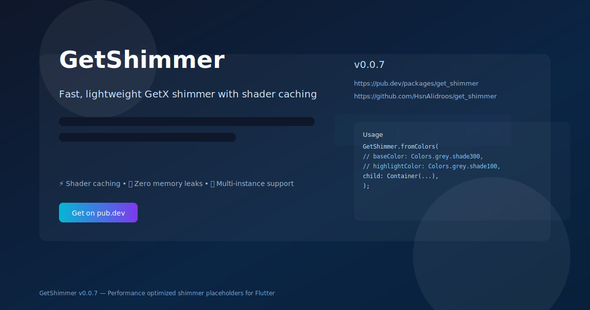

# GetShimmer

A small GetX-friendly Shimmer widget for Flutter.

<!-- Open Graph / social preview image -->


<p align="center">
    
</p>

This package provides a lightweight Shimmer widget built using `GetX` for
controller lifecycle and simple configuration. It uses a `ShaderMask` under the
hood to render an animated gradient over a child widget.

## Features

- ✨ Shimmer effect using `ShaderMask` and `AnimationController`
- 🎮 Uses `Get.put` for controller lifecycle, keeping widget code concise
- 🔄 Supports multiple shimmer directions: `ltr`, `rtl`, `ttb`, `btt`
- ⚡ **Performance optimized**:
  - Shader caching to reduce GPU work
  - Repaint boundary isolation
  - Proper ticker disposal (no memory leaks)
  - Zero overhead when `enabled: false`
- 🎯 Multiple independent shimmer instances supported

## Getting Started

Add `get_shimmer` to your `pubspec.yaml`:

```yaml
dependencies:
  get_shimmer: ^0.0.7
```

Then import it:

```dart
import 'package:get_shimmer/get_shimmer.dart';
```

## Usage

### Basic Usage

```dart
GetShimmer.fromColors(
  baseColor: Colors.grey.shade300,
  highlightColor: Colors.grey.shade100,
  child: Container(
    height: 200,
    width: double.infinity,
    color: Colors.white,
  ),
);
```

### Custom Gradient

```dart
GetShimmer(
  gradient: LinearGradient(
    colors: [Colors.grey.shade300, Colors.white, Colors.grey.shade300],
  ),
  child: YourWidget(),
);
```

### Different Directions

```dart
GetShimmer.fromColors(
  direction: ShimmerDirection.ttb, // top to bottom
  child: YourWidget(),
);
```

### Disable Shimmer

Set `enabled: false` to show the static placeholder without animation (useful
in tests or when you want to conditionally disable shimmer):

```dart
GetShimmer.fromColors(
  enabled: isLoading, // false shows static child
  child: YourWidget(),
);
```

## API Reference

| Property | Type | Default | Description |
|----------|------|---------|-------------|
| `child` | `Widget` | required | The widget to apply shimmer to |
| `gradient` | `Gradient` | required | The gradient for the shimmer effect |
| `direction` | `ShimmerDirection` | `ltr` | Animation direction |
| `period` | `Duration` | `1500ms` | Animation cycle duration |
| `loop` | `int` | `0` | Number of loops (0 = infinite) |
| `enabled` | `bool` | `true` | Toggle shimmer on/off |

## Additional Information

### Contributing

Contributions are welcome! Please open issues or PRs on the [repository](https://github.com/HsnAlidroos/get_shimmer).

### License

MIT License - see [LICENSE](LICENSE) for details.
